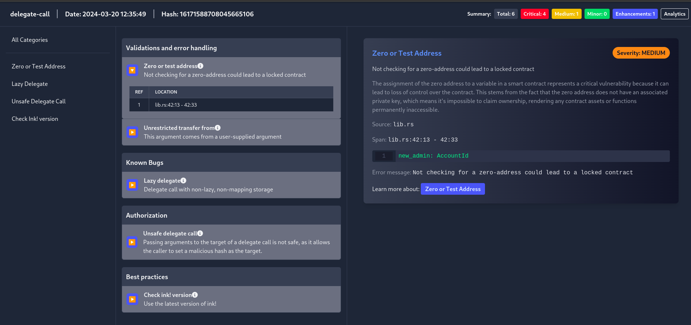

# Getting Started

Let's discover **Scout in less than 5 minutes!**.

## About Scout

Scout is an extensible open-source tool intended to assist ink! smart contract developers and auditors detect common security issues and deviations from best practices. This tool helps developers write secure and more robust smart contracts.

## Features

- A list of vulnerabilities, best practices and enhancements, together with associated detectors to identify these issues in your code
- Command Line Interface (CLI)
- VSCode Extension

### What you'll need

Make sure that [Cargo](https://doc.rust-lang.org/cargo/getting-started/installation.html) is installed on your computer. For using the VSCode Extension you must be using [VSCode](https://code.visualstudio.com/).

You should be able to install and run Scout without issues on Mac, Linux or Windows.

## Command Line Interface (CLI)

The command line interface is designed to allow you to run Scout on an entire project. It is especially useful for auditing or performing a final review of your code.

### Installation

FIn order to install the Command Line Interface, first install Scout dependencies by running the following command:

```bash
cargo install cargo-dylint dylint-link
```

Afterwards, install Scout with the following command:

```bash
cargo install cargo-scout-audit
```

### Usage

To run Scout on your project, navigate to its root directory and execute the following command:

```bash
cargo scout-audit
```

In the table below, we specify all the option available for the CLI.

| Command/Option                                                             | Explanation                                                                                                                                        |
| -------------------------------------------------------------------------- | -------------------------------------------------------------------------------------------------------------------------------------------------- |
| `cargo scout-audit`                                                        | Runs the static analyzer on the current directory                                                                                                  |
| `cargo scout-audit --help`                                                 | Provides a brief explanation of all the available commands and their usage.                                                                        |
| `cargo scout-audit --manifest-path <PATH_TO_CARGO_TOML>`                   | This option is used to specify the path to the Cargo.toml file that you want to analyze.                                                           |
| `cargo scout-audit --profile <PROFILE_NAME>`                               | This option allows you to analyze code using specific group of detectors, configured previously on `$HOME/.config/scout/(ink/soroban)-config.toml` |
| `cargo scout-audit --filter <DETECTOR_LIST_SEPARATED_BY_COMAS>`            | This option allows you to analyze code using specific detectors. Provide a comma-separated list of detectors for this purpose.                     |
| `cargo scout-audit --exclude <DETECTOR_LIST_SEPARATED_BY_COMAS>`           | With this command, you can exclude specific detectors from the analysis. You need to give a comma-separated list of the detectors to be excluded.  |
| `cargo scout-audit --list-detectors`                                       | Display a list of all available detectors.                                                                                                         |
| `cargo scout-audit --version`                                              | Displays the current version of the static analyzer.                                                                                               |
| `cargo scout-audit --verbose`                                              | Print additional information on run                                                                                                                |
| `cargo scout-audit --local-detectors <PATH_TO_FOLDER>`                     | Uses the detectors of a local folder. This considers the sub-folders as detectors.                                                                 |
| `cargo scout-audit --output-format [text,json,html,sarif,pdf,md,markdown]` | Sets the output format. Selecting `json`, `html`, `sarif`, `markdown`, or `pdf` will create a file with the output                                 |
| `cargo scout-audit --output-path <PATH_TO_OUTPUT_FILE>`                    | Sets the output path. If a format was selected, this will replace the default file with the given one                                              |

## Profile configuration

The profile configuration file is generated automatically in `$HOME/.config/scout/(ink/soroban)-config.toml` the first time scout-audit is run.
The configuration has the following format

```toml
[<profile-name>.<detector-name>]
enabled = <true|false>
```

For example, if you want to define a profile named 'dev' in which the 'panic-error' detector is disabled and the 'ink-version' detector is enabled, you should do the following:

```toml
[dev.panic-error]
enabled = false
[dev.ink-version]
enabled = true
```

## HTML Vulnerability Report

We've upgraded Scout's HTML output to introduce a comprehensive HTML Vulnerability Report, enhancing your ability to quickly assess and address the security status of your project. The new features included in the report are designed to provide a detailed yet concise overview of the findings.



Usage: `cargo scout-audit --output-format html`

## VSCode Extension

We built the Scout VSCode Extension to help developers write secure and more robust smart contracts. Listing security issues, and highlighting issues with squiggles and hover-over descriptions, we hope our extension will help you catch vulnerabilities during development.


### Installation

Install Scout from the Marketplace within the Extensions tab of Visual Studio Code. You can find the extension [here](https://marketplace.visualstudio.com/items?itemName=CoinFabrik.scout-audit).

You'll also need to have installed the CLI, as the extension uses the CLI to perform the analysis. You can find instructions for installing the CLI [here](#command-line-interface-cli).

### Usage

After you've installed the extension, simply open a project workspace that contains any ink! (.rs) files. You will see potential issues and warnings via a wiggle underline of the relevant code.
